# Variable-Liquid-Flow-Cold-Plate

# Variable Liquid Flow cold Plate

**Personal Project**
 

<!-- Final image of testing -->

## Overview

The scope of the project was not only to be introduced to fluid dynamics and transfer calculations, but to validate simulation data using Ansys Fluent. 

The first step was selecting several cold plate designs based on upon industry accepted designs. Hand calculations were then selected to determine the optimal geometry for a 100 Watt heat source which cannot exceed 40 Celsius. The four cold plates were evaluated in Ansys to map their performance including temperature, pressure loss and velocity. Different flow rates, # of fins and mesh quality were also evaluated.

The second aspect of the project was to design a PID loop to control the flow rate of the cold plates. A thermistor would serve as the input to maintain a constant temperature by adjusting the pump speed using pulse width modulation. The goal was to match pump energy with the power output of the heat source. 

## Bill of Materials
| Component | Function | Part | Photo |
|---|---|---|---|
| Pump | Sized to provide sufficient flow to pull heat away  | Kamoer 400ml/min | 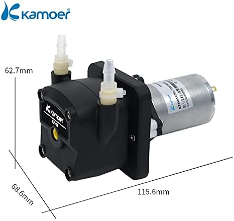 |
| Nozzle | sized for required tubing| 3/16" Barb to 1/8" NPT Male Thread  | 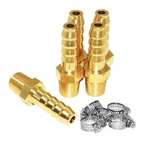 |
| Thermistor | changes resistance value based upon temperature |10K NTC Thermistor | 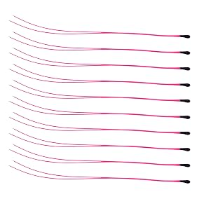 |
| Diode | Used to prevent energy build up from inductive load | 15A 45V Diode| 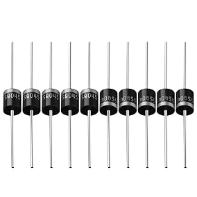 |
| Arduino Nano | Used to run PID loop | Arduino Nano |  |
| 20 AWG Wire | Used to safely transmit power to pump | 20 AWG doorbell wire|  |
| MOSFET | Used to control pump power | 55V, 74A MOSFET | 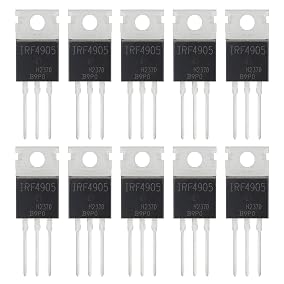 |

## Initial Calculations and Sizing
The initial sizing of the cold plates was calculated using equations provided by Advanced Thermal Solutions. Initial conditions were based upon common sizing and required conditions for electronic management. Many values such as density, thermal conductivity and specific heat were based upon the average fluid temperature as the water travels through the system. Ultimately using the maximum surface temperature, pump power and ease of manufacturing. channel width for the pin-fin was calculated to be 1.9 mm for the pin fin and straight fin and 6.0 mm for the serpentine plate. A fourth cold plate was designed using gyroids, a geometric shape with a high surface area while allowing fluid flow. The gyroid design was designed in MATLAB then converted to an STL file.

### Calculations

*Initial calculations used by Advanced Thermal Solutions*

### Plots
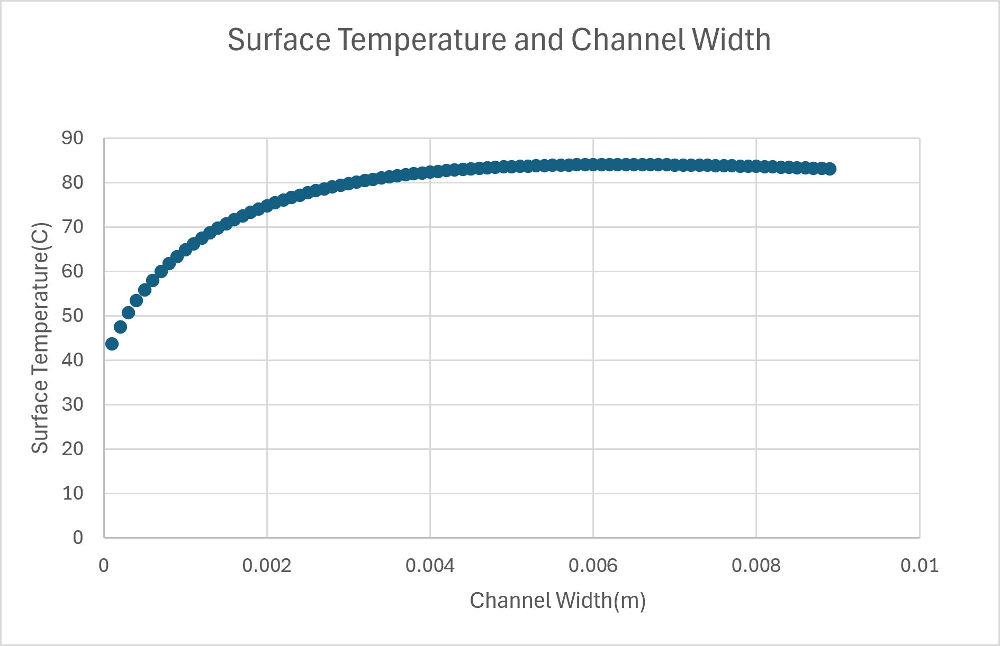

*Plots of straight and pin fin Cold Plate*

*Plots of serpentine cold plate*

*Gyroid Structure generated in MATLAB*

## Ansys Simulation

Afterwards the 4 cold plates were designed in Solidworks following the design specifications. The first simulations used initial conditions of .4 L/min, 100 watts and an aluminum construction with water as the working fluid. Further tests were done by evaluating how a different # of fins or fluid velocity affected the heat flux. Lastly a Mesh independence survey was done to verify the simulation was best representing the results.

### Simulation Results

*Initial Serpentine Results*

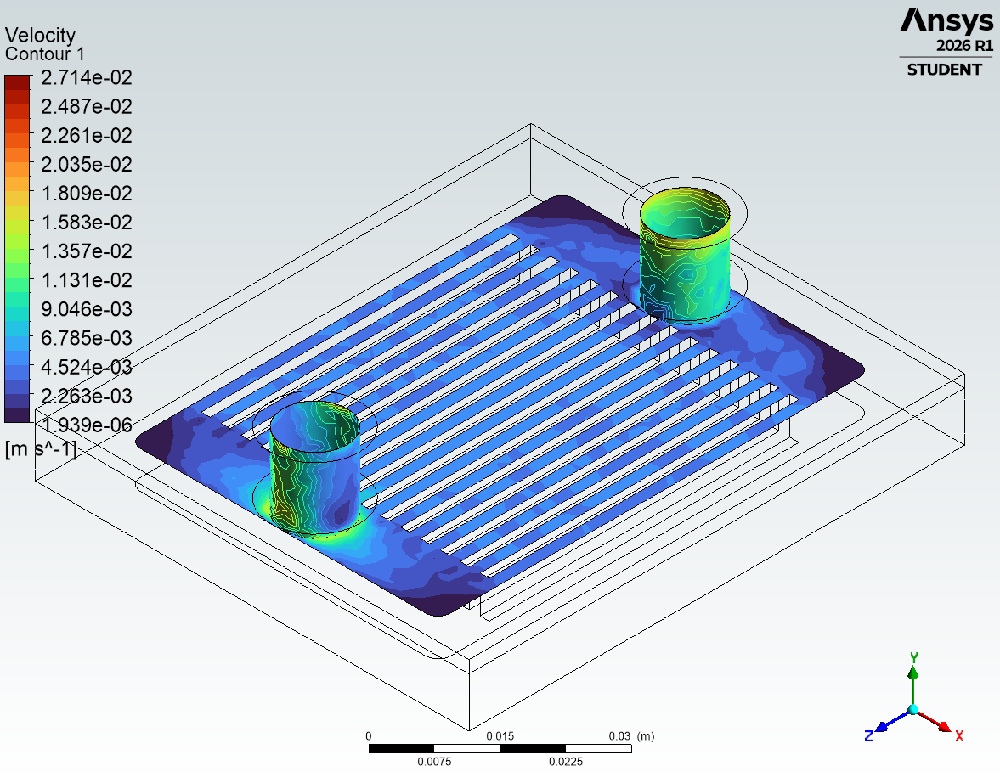
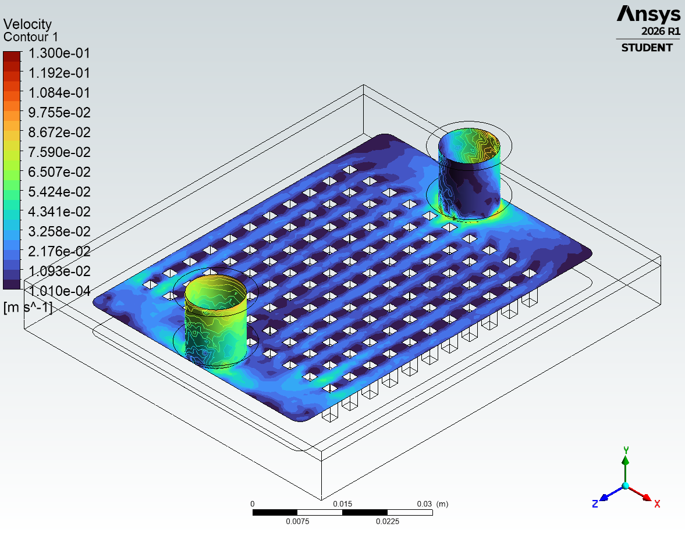
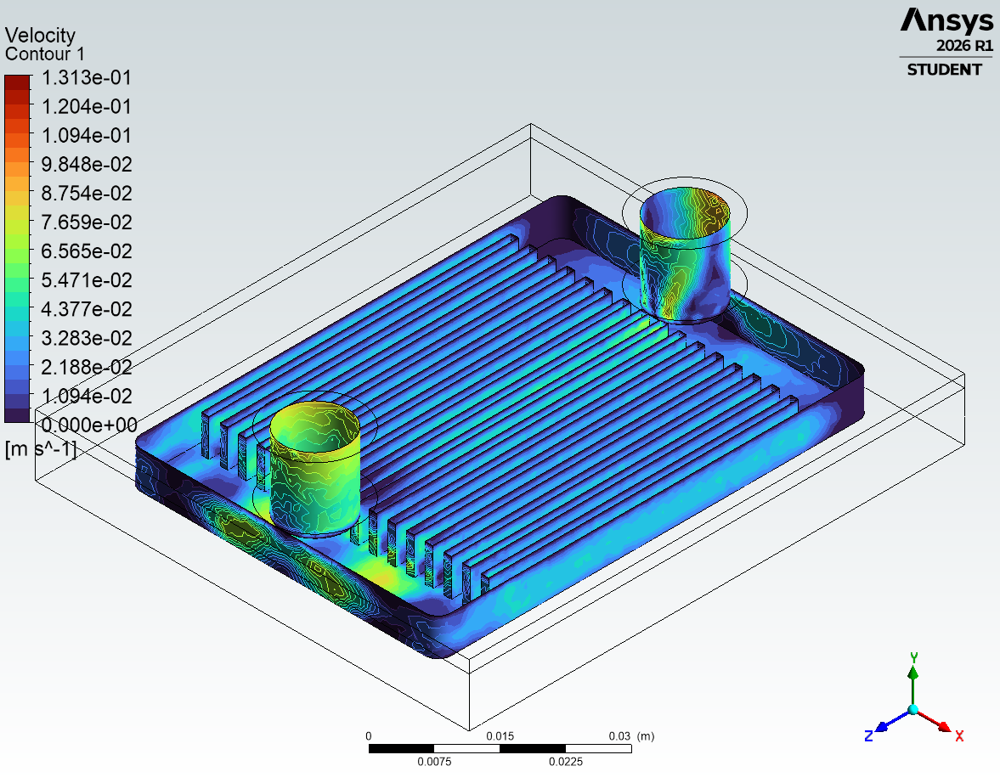

*Flow speed and changing fluid temperature*

*Results of Straight Fin*

*Results of Pin Fin*

*Mesh Independance Study Plot for Straight Fin*

*Mesh Independance Study Plot for Pin Fin*

### Control Wiring

The control wiring for the project included 3 thermistors to measure the incoming water temperature, the plate temperature, and the outlet temperature. The plate temperature was used as the primary input to the PID loop. 

A second circuit was used for the PWM circuit. a 2.2k pulldown was used to protect the Arduino from high current flow. A flyback diode was used to prevent energy storage from induction. A power supply was connected to the drain and source ends of a MOSFET while the Arduino was connected to the switch end.

<!-- Circuit Board with Callouts -->
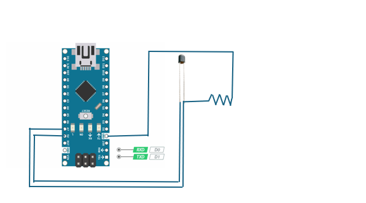
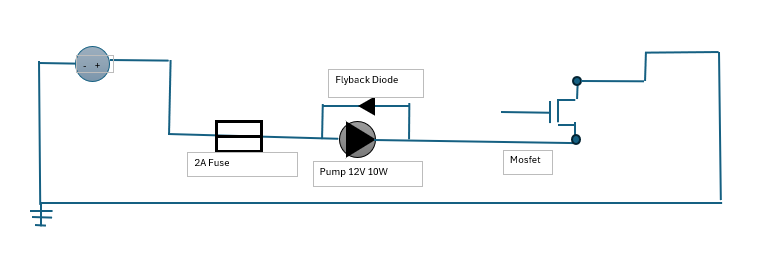
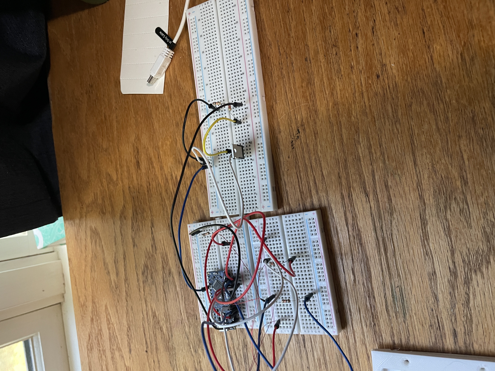
<!-- Temperature Sensing code -->
<!--  -->
<!-- PID Code -->
<!--  -->

*Temperature sensing circuit and PID loop*

## Temperature Sensing Code
'''
      #include <PID_v1.h>
      
      
      const int SENSOR_PINS[] = {A0, A1, A2};
      const int NUM_SENSORS = 3;
      
      
      const float R_FIXED = 10000.0; // 10k fixed resistor
      const float R0 = 10000.0;      // 10k thermistor nominal resistance at 25°C
      const float T0 = 298.15;       // 25°C in Kelvin
      const float BETA = 3950.0;     // Beta coefficient (typically 3435 - 3950)
      
      void setup() {
        Serial.begin(9600);
      }
      
      void loop() {
        for (int i = 0; i < NUM_SENSORS; i++) {
          float tempC = readTemperatureC(SENSOR_PINS[i]);
          float tempF = (tempC * 9.0 / 5.0) + 32.0;
      
          Serial.print("Sensor ");
          Serial.print(i + 1);
          Serial.print(" (A");
          Serial.print(i);
          Serial.print("): ");
      
          if (tempC > -200) { // Check for valid reading
            Serial.print(tempC, 1);
            Serial.print(" °C / ");
            Serial.print(tempF, 1);
            Serial.print(" °F    ");
          } else {
            Serial.print("Error    ");
          }
        }
        Serial.println(); // Print a new line after reading all 3 sensors
      
        delay(1000); // Read every second
      }
      
      
      float readTemperatureC(int pin) {
        // Dummy read + tiny delay to let the Arduino ADC capacitor settle 
        // when rapidly switching between multiplexed analog channels
        analogRead(pin); 
        delay(5);
        int adcValue = analogRead(pin);
      
        if (adcValue <= 0) return -999.0; // Prevent division by zero
      
        // Calculate thermistor resistance
        float rTh = R_FIXED * ((1023.0 / (float)adcValue) - 1.0);
      
        // Beta equation
        float steinhart = rTh / R0;
        steinhart = log(steinhart);
        steinhart /= BETA;
        steinhart += 1.0 / T0;
        float tempKelvin = 1.0 / steinhart;
      
        return tempKelvin - 273.15; // Convert Kelvin to Celsius
      }

'''

## Fabrication

<!-- PLA PROTOTYPE -->

*prototypes were created in PLA to be used for flow testing evaluating working pressure drop and flow.*

## Future Work

- **Reprinting the cold plates**: The 3D printer used for manufacturing lost power to heated bed causing small deformities in the print making them incapable of holding a seal. Future 3D prints should not encounter the same issue allowing for further testing to validate CFD results. 
- **Further mesh refinement** Mesh Geometry was limited to Ansys student mesh sizes. Further mesh sizing could be done by adaptive mesh sizing or body of influence.  

## Lessons Learned

- **Be mindful of ease of manufacturability** Working on the project made me consider how the cold plate could be machined. The channels were sized in way to avoid breaking tools. Additionally the parts were designed to be manufactured using only a 3 axis CNC. 
- **create flow tight design** The design lacked some necessary mounting screws to ensure a sealed environment. Further mounting screws would ensure a better seal.
